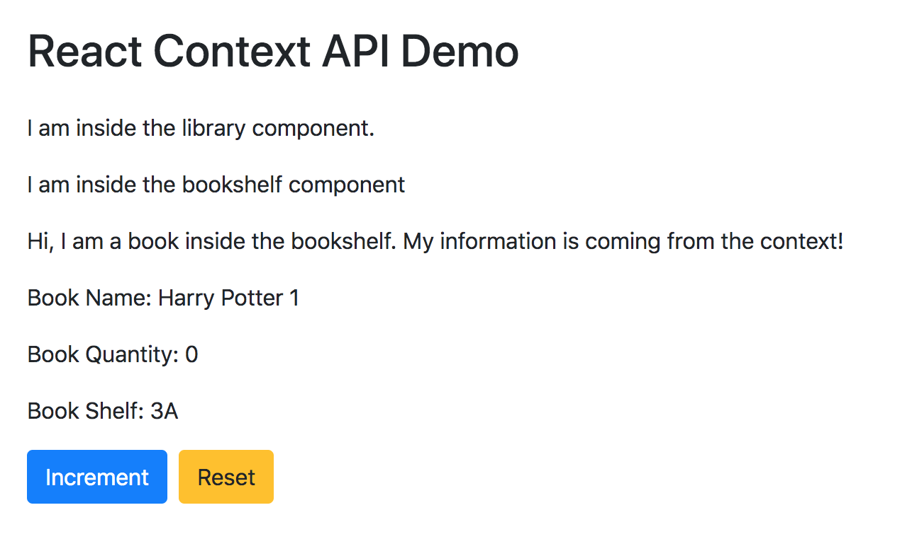

# React State Management with Context API and Hooks

## Introduction
This sample showcases how to create, use and manage React state using Context API and Hooks.

**About the sample**

This is simple library application which has shelf with books. We use context API and hooks to manage books quanity data state.



## 1. Create React App

```
npx create-react-app context-api-demo
```

then add bootstrap to public/index.html for some styling to demo app

```
<link
      rel="stylesheet"
      href="https://stackpath.bootstrapcdn.com/bootstrap/4.5.0/css/bootstrap.min.css"
      crossorigin="anonymous" 
/>
```

## 2. UI Components

## 3. Context API and State management

## 4. Access State inside Components

<br>

# Summary from Demo App

Here's the summary of using Context API and Hooks for state management
- Create context using createContext method
- Create the Provider component with the values to pass as state
- Create the Reducers to manipulate the state using useReducer hook
- Wrap the component where value has to be accessed inside the Provider component
- Access values using useContext hook

<br>

# You can use this repo and run a demo

**Installation**

Clone repo locally
```
git clone https://github.com/vemuruadi/context-demo-api.git
cd context-demo-api
```

**Install dependencies**
```
Yarn
or 
npm i
```

**Run the development demo**
```
yarn start
or
npm start
```